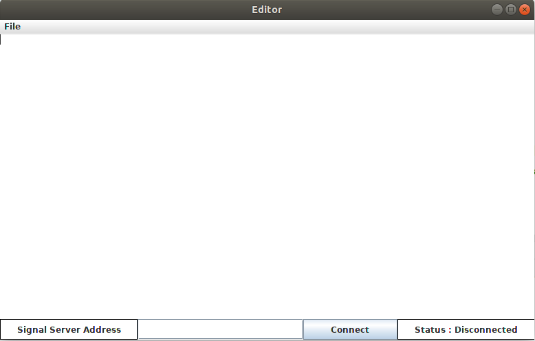

# Tugas Besar 1 IF3230 Sistem Paralel dan Terdistribusi

## Peer-to-Peer Collaborative Editing menggunakan Conflict-free Replicated Data Type (CRDT)

#### Kelompok 4

13516005 - Rizki Alif Salman A.

13516089 - Priagung S.

13516140 - Ilham Firdausi P.

---
## Petunjuk penggunaan :
1. Jalankan program *signal server* pada ip address dan host yang diinginkan pada Signal.java
2. Jalankan program *text editor*, window *text editor* akan terbuka
3. Masukkan host address pada *text field* di bawah dengan format "[ip address]:[port]", misal "192.168.43.49:8885". 
4. Setelah itu, tekan tombol *connect* untuk memulai koneksi ke *signal server*. *signal server* akan secara otomatis memberitahukan host-host lainnya yang sedang terhubung ke *signal server*. Program akan menghubungkan perangkat ke host-host tersebut secara otomatis.
5. Program *collaborative text-editor* sudah dapat digunakan.
---
## Worklog
##### 13516005 - Rizki Alif Salman Alfarisy
* GUI
* Integrasi GUI dengan controller
* Laporan

##### 13516089 - Priagung Satygama
* CRDT
* Socket
* Version Vector
* Deletion Buffer

##### 13516140 - Ilham Firdausi Putra
* Signal Server
* Version Vector
* Deletion Buffer
* Laporan

---
## Laporan
### Cara Kerja Program 
* Setiap node akan saling terhubung satu sama lain dengan bantuan signal server
* Pada setiap text editor, program akan mendeteksi apabila ada karakter yang diketik (insert) atau dihapus (delete)
* Apabila program mendeteksi salah satu dari operasi di atas, program akan meng-*update* cdrt dari node tersebut, kemudian mem-*broadcast* operasi tersebut ke seluruh node lainnya yang terhubung dengan node yang melakukan operasi
* Apabila node menerima informasi operasi dari node lain, host akan meng-*update* CDRT berdasarkan operasi yang didapat. Kemudian  program akan meng-*apply* operasi tersebut ke *text editor* untuk menampilkan perubahan yang baru saja terjadi
* Khusus untuk penerimaan operasi *delete*, sebelum operasi tersebut dilakukan  operasi akan disimpan dulu di *delete buffer* hingga karakter yang terlibat dengan operasi tersebut sudah diterima oleh program

### Arsitektur Program
Program ini secara garis besar terdiri dari:
* Controller (Controller.java) - bagian utama dari program yang berfungsi untuk mengatur jalannya program.
* Conflict-free Replicated Data Types (CRDT.java) - data struktur utama yang mendasari cara kerja program ini. Data struktur CRDT ini telah memungkinkan kami untuk mengembangkan sebuah platform penyunting teks peer-to-peer.
* Model (Character.java, LocalCharacter.java, Position.java) - tipe dasar data yang kami gunakan dalam berkomunikasi antar node dalam koneksi.
* Editor (Editor.java) - graphical user interface (GUI) yang kami gunakan untuk berinteraksi dengan program.
* Messenger (Messenger.java) - bagian program yang berfungsi untuk berkomunikasi dengan node lain dalam koneksi.
* Version Vector (VersionVector.java) - bagian program yang berfungsi untuk mencatat versi karakter yang sudah diketik agar terhindar dari kasus di mana operasi delete dijalankan pada karakter yang belum ada.
* Signal (Signal.java) - bagian program yang berfungsi untuk melakukan inisialisasi koneksi kepada seluruh node yang ada pada koneksi.

  

### Struktur Data
Terdapat beberapa struktur data yang memegang peran penting di dalam Collaborative Text-Editor kami, diantaranya :
* **CRDT** : CRDT merupakan singkatan dari conflict-free replicated data type. CRDT merepresentasikan seluruh teks yang saat ini sedang dikerjakan oleh semua node. CDRT disebut replicated dikarenakan setiap node memiliki replika dari struktur data ini. CRDT juga harus dipastikan conflict free agar ketika setiap node meng-update CRDT berdasarkan operasi yang diterimanya, hasil updatenya tetaplah sama. Pada program kami, CRDT diimpementasikan dengan menggunakan tree of integer. Kelas CRDT dapat mengonversi integer-integer pada pohon menjadi index asli yang akan digunakan untuk menampilkan teks di GUI. Selain itu, CRDT juga memiliki method untuk melakukan insert dan delete, baik secara local (jika perubahan di node sendiri) ataupun remote (jika menerima operasi dari node lain).
*  **Version Vector** : Version vector digunakan untuk menyimpan informasi mengenai versi node. Version vector kami implementasikan sebagai kelas dengan atribut site-id (id node) dan counter (jumlah operasi yang sudah dilakukan sejauh ini). Version vector digunakan bersama dengan deletion buffer untuk memastikan tidak ada race condition operasi di setiap node.
*  **Deletion Buffer** : Deletion buffer berfungsi untuk mempertahankan *causality* dari setiap node untuk kasus deletion. Implementasi dari deletion buffer pada program kami berupa sebuah array list di controller yang berisikan operasi delete yang akan dilakukan di node tersebut. Operasi delete pada deletion buffer baru akan dieksekusi seteleh counter pada version vector node tersebut sama dengan counter pada operasi. Pada program kami, deletion buffer dijalankan di thread terpisah dan setiap operasi di dalamnya selalu dibandingkan counter-nya dengan counter version vector node tersebut.

### Analisis Solusi
Solusi yang kami buat telah berhasil memenuhi spesifikkasi yang diminta pada tugas besar. Akan tetapi, terdapat beberapa hal yang masih dikembangkan pada program kami, yaitu :
* Handling race condition yang lebih baik. Terdapat beberapa kasus race condition yang mungkin dapat ditangani dengan lebih baik menggunakan mekanisme lock atau mutex.
* Beberapa struktur data tidak terlalu efisien. Ada struktur data seperti version vector dan character (operasi) yang redundan. Misalnya, pada program kami character memiliki site-id dan version vector, akan tetapi version vector juga memiliki site-id.

### Kasus Uji
| Kasus Uji | Deskripsi Pengujian  | Keluaran yang diharapkan |
| --------- | --- | --- |
| *Concurrency Test* | Mengetik di salah satu node, kemudian mengecek text editor di node lain | Seluruh text editor menampilkan teks yang sama dengan node yang baru saja mengetik |
|*Commutative Test*|Menghapus dan memasukkan karakter di index yang sama pada saat bersamaan, kemudian mengecek hasilnya. Teks yang digunakan adalah "hat", salah satu node menambahkan c di index ke-0,  menghapus karakter h|Di kedua node kata yang ditampilkan adalah "cat"|
|*Idempotent Test*|Dua node menghapus karakter di index yang sama pada saat bersamaan. Kata yang digunakan adalah "hat", kedua node mencoba untuk menghapus karakter h |Di kedua node kata yang ditampilkan adalah "at"|
|*Deletion Buffer Test*|Salah satu node diberikan delay pada proses insert, node lainnya mengetikkan karakter kemudian langsung menghapusnya.|Node yang diberikan delay mampu menunggu karakter ditambahkan baru menghapusnya tanpa terjadi error.|

### Screenshot/Video Program
Screenshot :

  

Cek demo program kami [di sini](https://drive.google.com/drive/folders/1t8LxeR9u4MOLSO_XD3VzZGVQWT0JeBAN?usp=sharing)

---
# Thank You